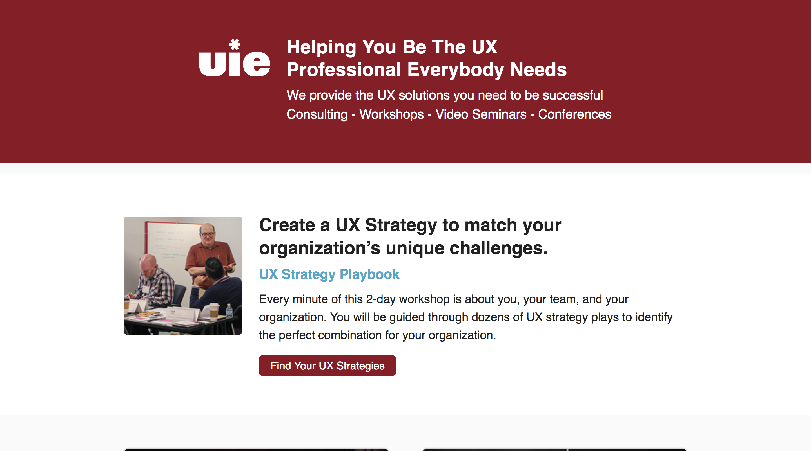
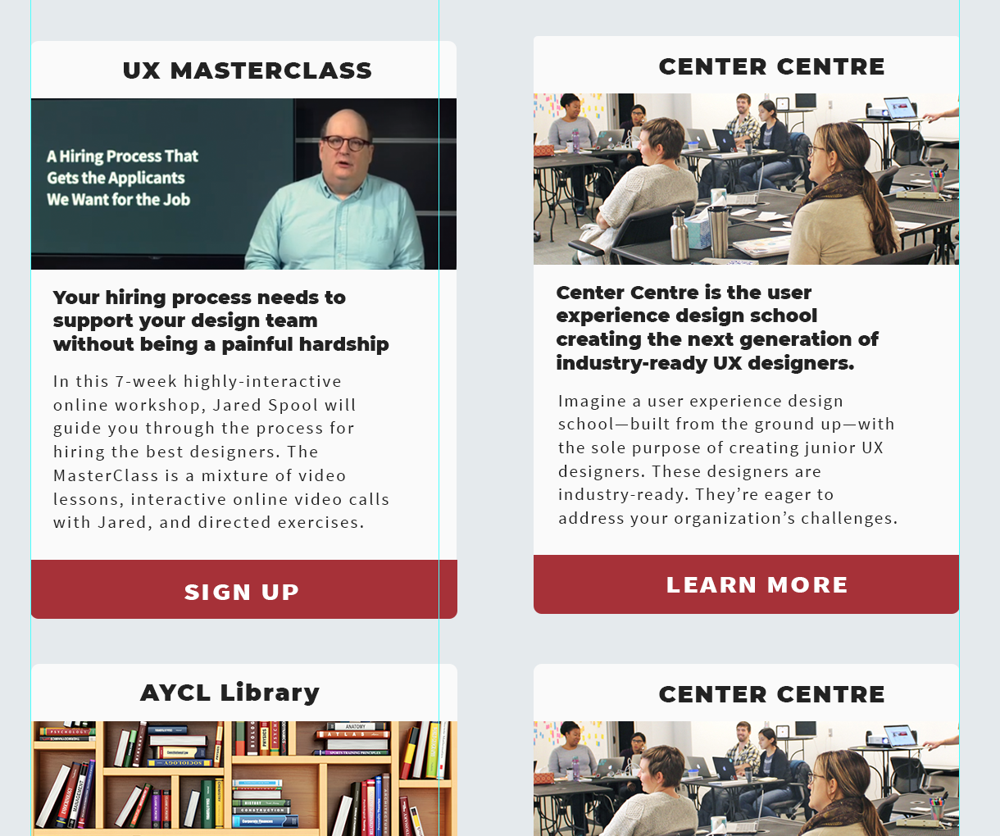

---

path: '/blog-posts/uie-landing-page-project-part-ii'

date: '2020-06-22'

title: "UIE Landing Page Project Part II"

tags: ["UIE", "WordPress", "Boston"]

excerpt: "Part II in the reflection and process of my final intern project at UIE. The final product is in production on UIE's website."

---

Check out the first part here, [UIE Landing Page Project Part I](/blog-posts/uie-landing-page-project-part-i)

    

        
            

In the previous post I talked about the design process, user testing, and beginning the html prototype. At this point in the project I had a few different html prototypes that were informed by our user testing sessions. Out of those sessions we had more information to use too: which buttons made the most sense, how easy or difficult it was to find content depending on wording/length, and some issues with our cross site image. We still had several steps left to launch the new design:
+ Choosing a final design
+ Coding the final project
+ Cross-browser and device testing / optimization
+ Final bug pass and staging of site
+ Hosting on our server

&nbsp

##Coding the final design
We decided upon a final design from the two remaining html prototypes and it was time to code. I knew I wanted to code this project using more modern practices, at the very least making use of <strong>CSS Flexbox</strong>. I also thought this could be a good use case for <strong>CSS Grid</strong>, which in 2017 was still a newer capability CSS. Both of these techniques were relatively newly supported by browsers and I knew I would run into issues with older or less popular browsers.

    

        
            

Flexbox and css grid ended up working very well for the design, and it would be intuitive enough for our other developers or the next interns to update following my comments. Creating a design that scaled to mobile/desktop was a treat using grid, and flex. I created media queries according to various break-points (where the elements on the page didn't work as intended or make sense within the space of the screen,) in my design and flex properties handled the transition between each break.

The most difficult part in coding was the compatibility of css grid (and to a much smaller extent flexbox) with older browsers. I used a browser emulating service like [BrowserStack](https://www.browserstack.com/) to test across versions/OS/and browsers. I would test a design in a browser and make note of the issues, trying to find as many similar discrepancies to fix at once. With the help of stack overflow and some documentation I was able to get the design working across all of the tested versions we were targeting. A big crutch was using the float property on older browsers (the float property was viable for the entire design but is unintuitive and wonky when compared to modern options, imo). 

##SCSS 
Discussions of creating a pattern library for our company's identity across our different web properties led me to convert our css structure into SCSS. SCSS would allow me to create variables and code that could be used throughout the different pages and css files of our websites. This would assist in the future adoption of a pattern library and make different elements consistent across different pages.

In order to compile our SCSS I used a node library called Gulp. Gulp takes all of the different scss files, makes sense of the variables I've created, and compiles them into one big css file that the browser can easily read from. 

##Final Steps
The last steps of the project were to fit the html and css design into our WordPress theme and continue to convert the other elements of the theme to use scss and to point correctly to the new landing page. In the final blogpost I would like to detail the WordPress implementation, staging and hosting of the new site, and the small issues we ran into after the launch. Check back for part III.

###Mark Swinimer